### Create a package website

Next to the built-in support generated by documenting your package (such as the help files), a potential user of your package would benefit greatly from a package website. See for example the package website of the imputation package [`mice`](https://amices.org/mice/). This website was created with just a few lines of code, with the `pkgdown` package.

If you're programming in RStudio, and you want to load a package's website, just run:
```{r, eval=FALSE}
usethis::browse_package("mice")
```
::: {.callout-tip}
When asked which website to visit, choose `amices.org/mice`:
```
Which URL do you want to visit? (0 to exit) 

1: https://github.com/amices/mice        (URL field in DESCRIPTION)
2: https://amices.org/mice/              (URL field in DESCRIPTION)
3: https://stefvanbuuren.name/fimd/      (URL field in DESCRIPTION)
4: https://github.com/amices/mice/issues (BugReports field in DESCRIPTION)

Selection: 
```
Selecting option `2` will direct you to the package home page.
:::

It is very easy to create a website for your R package with `pkgdown` tools. First, set-up the website structure using:
```{r, eval=FALSE}
usethis::use_pkgdown()
```

Then load a preview of the website with:
```{r, eval=FALSE}
pkgdown::build_site()
```

As you'll see, this is quite a bare bones website, but it has all the structure you need: a landing page to explain what the package is set up to do, a reference page with an overview of all of the R functions that are available in your package, and some information about who built the package and how others can use it. 

### Add contents to the website

To add more content to the website, we should create a markdown file with some information about our package. It is good practice to create an R Markdown `README` document, because this allows us to showcase the functionality of our package with code chunks. You can edit this R Markdown file as you would any markdown or Quarto document. `pkgdown` will then programmatically generate a plain markdown version of this document to show on the package website.

Generate a `README` file as follows:
```{r, eval=FALSE}
usethis::use_readme_rmd()
```

This will generate a template file for you to fill in, with prompts such as:

```
The goal of roundR is to ...

## Installation

You can install the development version of roundR like so:

```

::: {.callout-tip}
Notice the comment all the way at the top of the `Rmd` file?
```
<!-- README.md is generated from README.Rmd. Please edit that file -->
```
Don't remove this as this will serve as a reminder for any contributor on your package not to edit the programmatically generated plain markdown file.
:::

Edit the `README.Rmd` file by adding the goal of the package:
```{r, eval=FALSE}
The goal of roundR is to offer a numeric rounding to the nearest integer, as opposed to the [base::round()] default to round to the nearest *even* integer.
```
And add an example:
```{r, eval=FALSE}
library(roundR)
## basic example code
round(2.5)
round_to_integer(2.5)
```
Then remove all text below the example, starting with '`What is special about...`' all the way to the end of the file.

The `README.Rmd` file now contains the aim of the package and an example. To generate the plain markdown version that will be recognized by `pkgdown`, run:
```{r, eval=FALSE}
devtools::build_readme()
```

Now, we can re-render the package website:
```{r, eval=FALSE}
pkgdown::build_site()
```

::: {.callout-tip}
Notice that we haven't replaced some of the `README` template? 
```r
# FILL THIS IN! HOW CAN PEOPLE INSTALL YOUR DEV PACKAGE?
```
That's because we haven't uploaded the package to GitHub, for others to be able to install the package with `devtools::install_github()`. Let's do that now!
:::

We have created a fully functioning package website. Let's upload it to GitHub to share it with the world.

### Uploading to GitHub

::: {.callout-tip}
This section assumes that you are logged into your GitHub account. If you have trouble realizing this, [GitHub has a great step-by-step walk through](https://docs.github.com/en/desktop/installing-and-configuring-github-desktop/installing-and-authenticating-to-github-desktop). 
:::

#### Using GitHub Desktop

Let's publish our R package to GitHub. To do so, we need to perform two steps. First, we must log (commit) our changes to the `git` distributed version control system. This stores the file changes to our own machine. Next we must link our local `git` to a remote online repository on GitHub. Luckily, with 'GitHub Desktop', we can perform all these steps in a single window interface. 

Let's start by adding our R package to GitHub Desktop. Remember that we already started the package in RStudio as a `git` repository, so we only have to point GitHub Desktop to the correct directory.
<center>
{width=90%}
</center>

Next, we commit the changes. This means that we save the state of files for a moment in time, so that we can always revert to that state and see how the files changed with respect to the previous state. 
<center>
{width=90%}
</center>

::: {.callout-tip}
Naturally, you would not only do this at the start (when RStudio created the `git` repository) and end (when we have a working package), but at regular and informative intervals. For example, when you add a function, a test, a help file, a license, etcetera. 
:::

Now that we have committed our package, we can publish it on GitHub.
<center>
{width=90%}
</center>

#### Using RStudio and the `usethis` package

An alternative in RStudio would be to explicitly enable `git` by running:
```{r, eval=FALSE}
usethis::use_git()
```

::: {.callout-tip}
When offered to commit, select the affirmative.
```
ℹ There are 13 uncommitted files:
• _pkgdown.yml
• .gitignore
• .Rbuildignore
• DESCRIPTION
• LICENSE
• LICENSE.md
• man/
• NAMESPACE
• R/
• README.md
  … and 3 more
! Is it ok to commit them?

1: Absolutely
2: No
3: Negative

Selection: 
```
In this case:
```
Selection: 1
✔ Adding files.
✔ Making a commit with message "Initial commit".
```
:::

We can then upload the committed files by creating and linking a GitHub repository:
```{r, eval=FALSE}
usethis::use_github()
```
This will generate the online repo and add the links to the package `DESCRIPTION`.

::: {.callout-tip}
When asked to commit these changes, allow this:
```
✔ Creating GitHub repository "hanneoberman/roundR".
✔ Setting remote "origin" to "https://github.com/hanneoberman/roundR.git".
✔ Adding "https://github.com/hanneoberman/roundR" to URL.
✔ Adding "https://github.com/hanneoberman/roundR/issues" to BugReports.
ℹ There is 1 uncommitted file:
• DESCRIPTION
! Is it ok to commit it?

1: No way
2: Yes
3: Not now

Selection: 
```
Select the affirmative, such as:
```
Selection: 2
✔ Adding files.
✔ Making a commit with message "Add GitHub links to DESCRIPTION".
✔ Pushing "master" branch to GitHub and setting "origin/master" as upstream branch.
✔ Opening URL <https://github.com/hanneoberman/roundR>.
```
:::

This procedure will automatically open the newly created GitHub repo for you to (re)view.
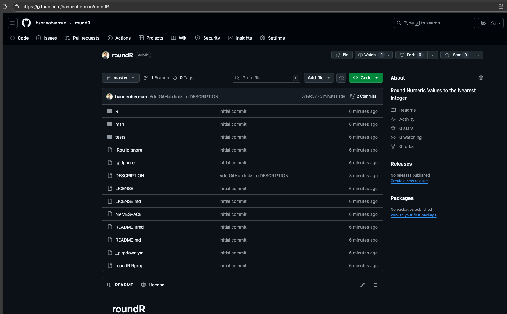

### Review the package on GitHub

Find your online GitHub repositories at [https://github.com](https://github.com). You will see your package there, and that the license and README are automatically recognized. 

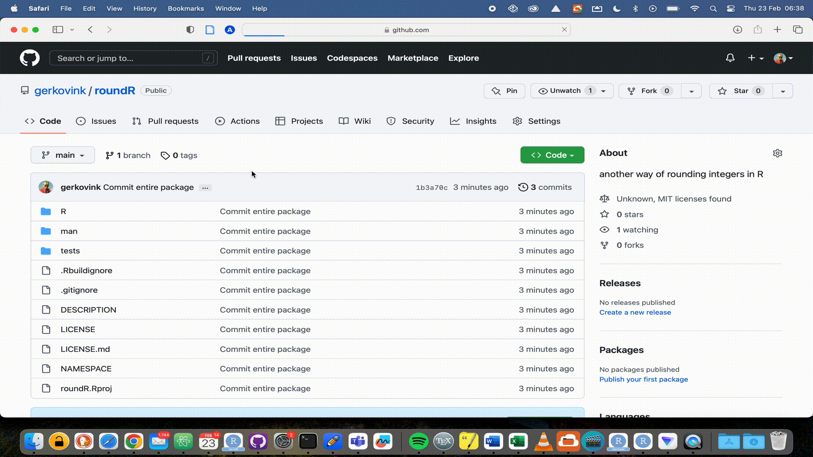

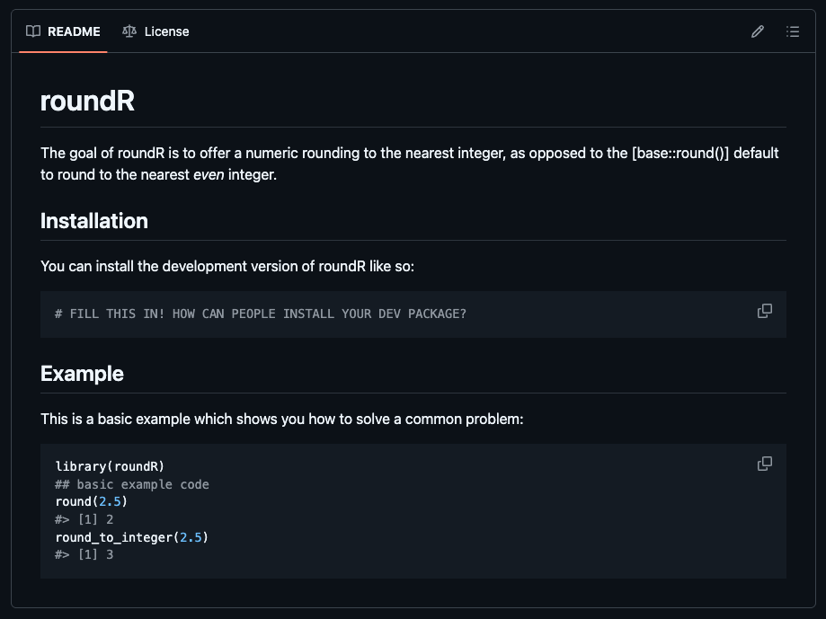

Now, we can edit the `README` file to add how others can install the package. We can do this locally (in RStudio on your PC), or edit the file on GitHub. For educational purposes, let's try and edit this file online.

### Edit the `README` file

Now that our package is online, if we want to make changes to the package, we should avoid introducing bugs on the live version. The live version of the package is in the `main` (or `master`) branch, which we should protect against 'breaking changes'. 

::: {.callout-tip collapse="true"}
# How to change the name of the `master` branch to `main`?
In your online repository, go to Settings.
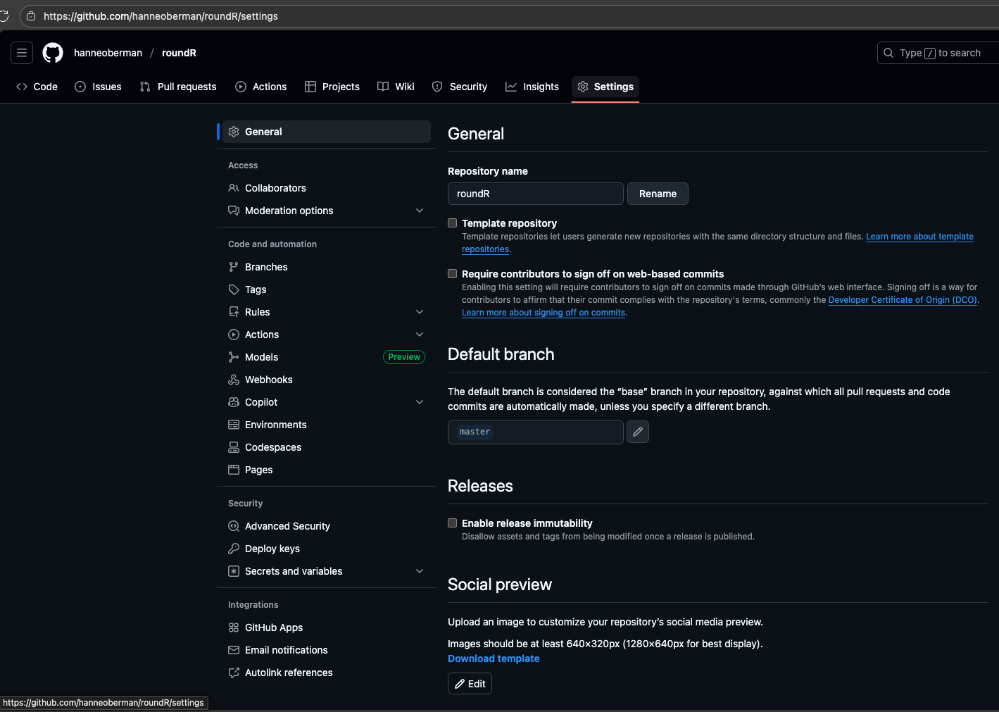
Under 'Default branch' click the edit button (pencil icon).
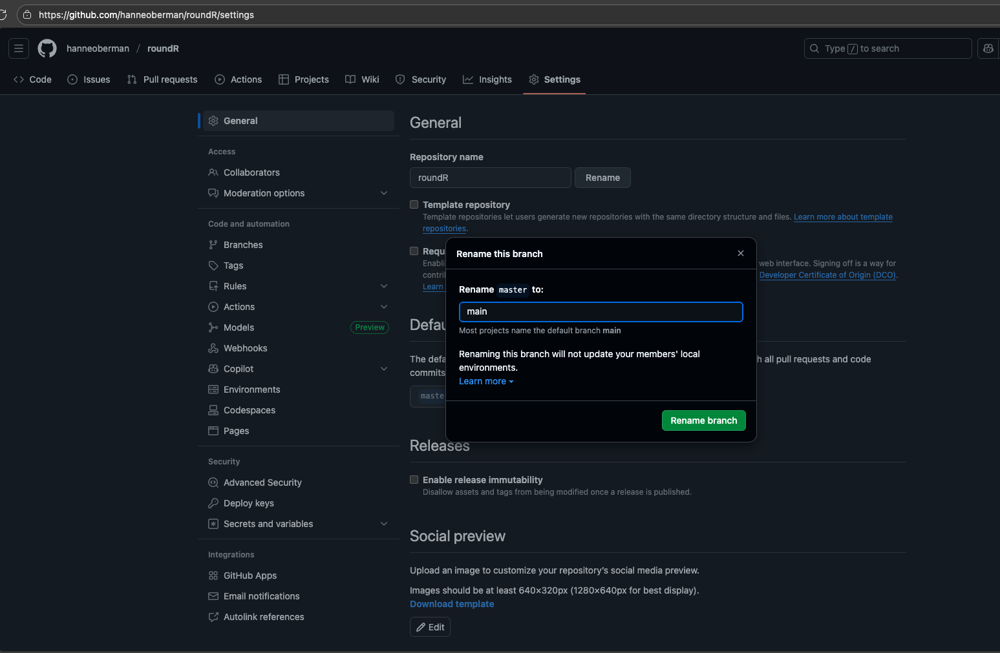
Fill in `main` where it said `master` and click 'Rename branch'. Online, the branch has now been renamed. We still have to update the local version of the repository by copying the suggested code. Otherwise, the changes on your PC will not be automatically visible online.
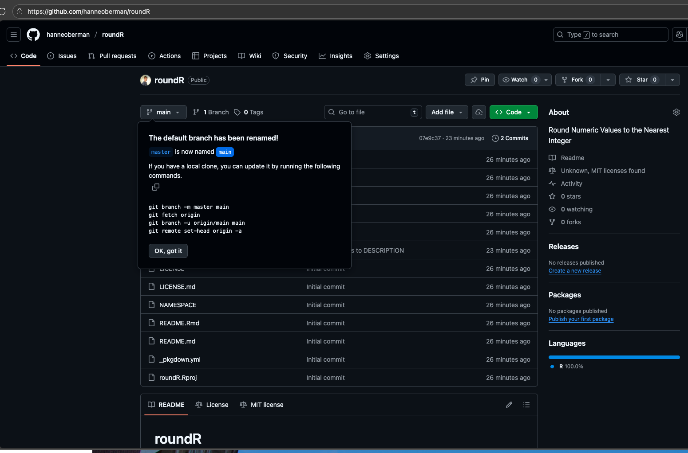
This code can be run in any terminal, for example the one in RStudio (the tab next to the console).
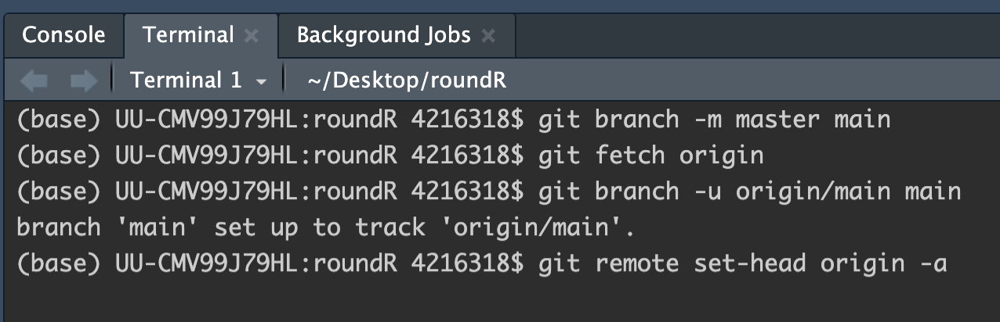
Now, your local version is up-to-date with the online version again with the renamed branch.
:::

We will extend our workflow with a good behavior: not working in the `main` branch. We would not want to accidentally overwrite or break the functionality of our package, for example when working in parallel in the same branch. So let's add some changes to a new `development` branch. 

Click the `README.Rmd` file in the online GitHub repository. The file will open in the online code editor.
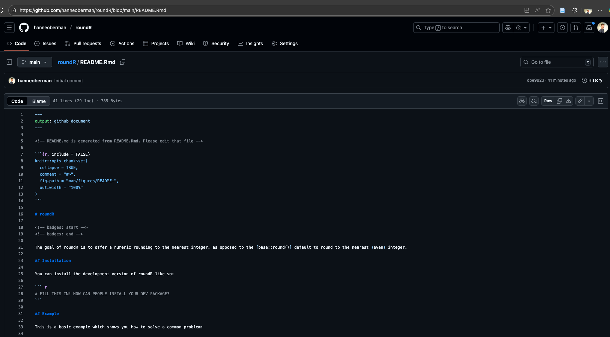

Replace the template text for installation with the code to install it from your repository, for example:
```{r, eval=FALSE}
devtools::install_github("hanneoberman/roundR")
```
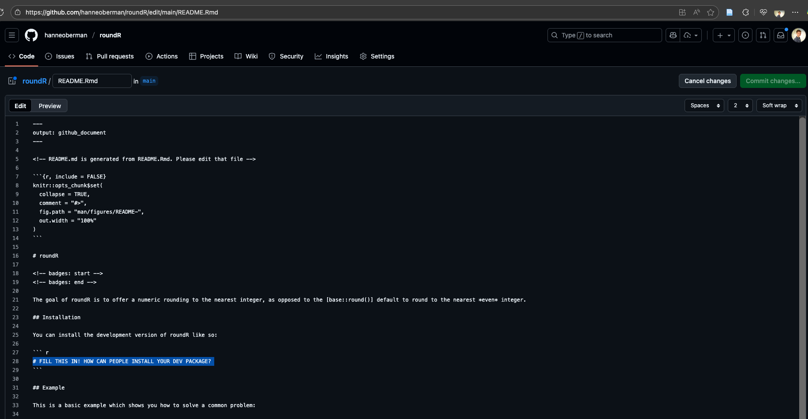
After editing the README, click 'Commit changes'.
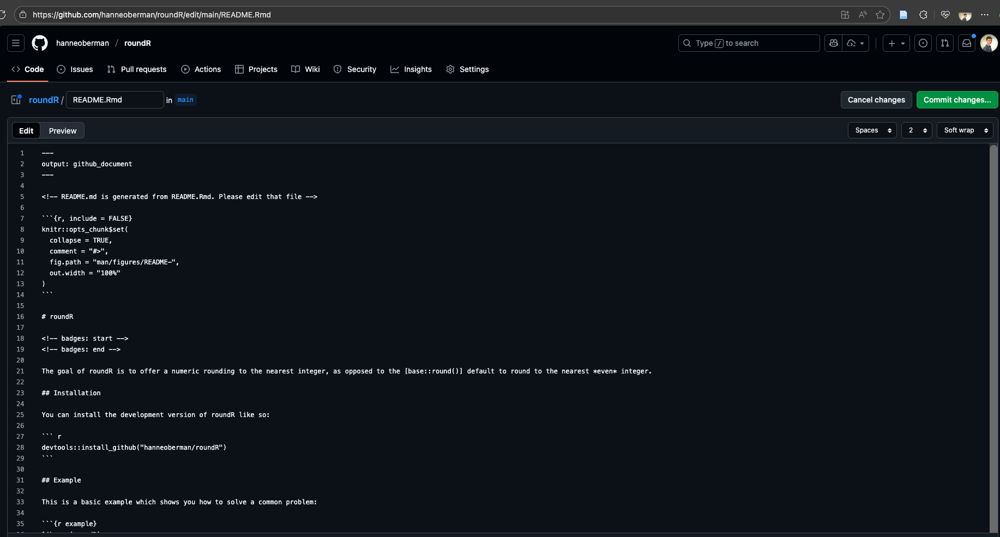

A window will pop up. Add an informative commit message (and description). Moreover, we should make sure that our edits will not go the the live version of the package on the `main` branch, but to create a development branch. Click 'Create a new branch for this commit and start a pull request' and name the branch `development`.
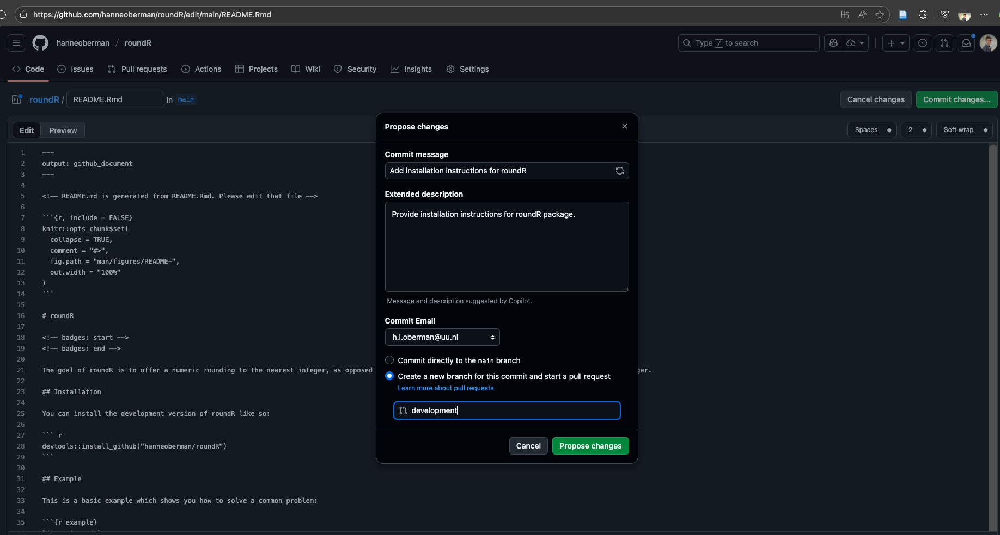
We can now click 'Propose changes' to commit the changes to the new `development` branch.

<!-- Click the `Add a README` button on the GitHub repository. Commit the changes to a new branch called `development`.  -->

<!-- <center> -->
<!-- {width=90%} -->
<!-- </center> -->

When we commit the changes in the `README` file to the `development` branch online, a new window opens to propose a `pull request` (PR). 
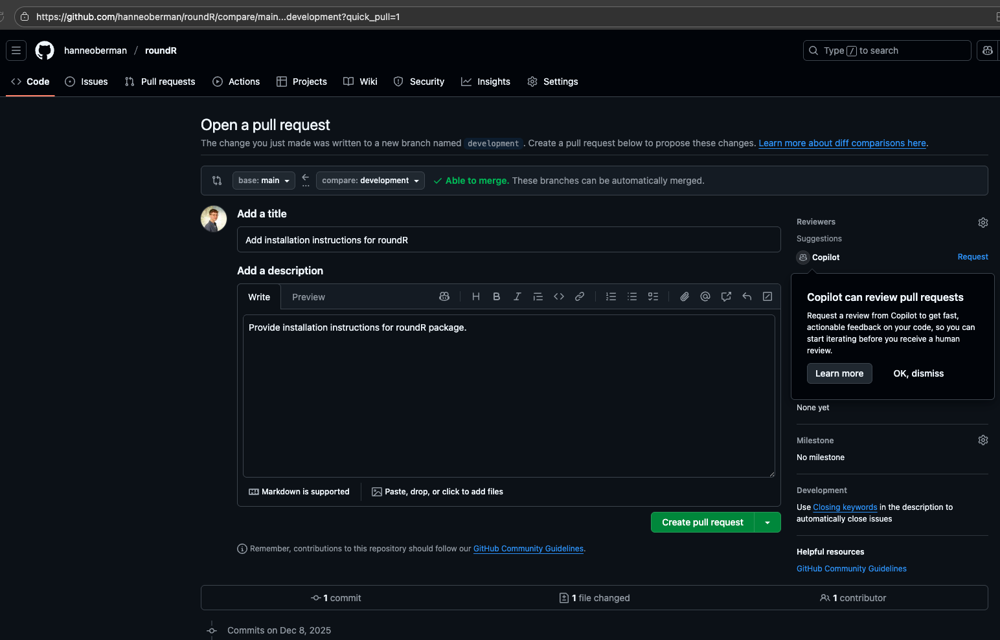
It is good procedure to write an informative pull request message, usually outlining the nature and rationale of the changes. 

Click 'Create pull request'. 

::: {.callout-tip}
The pull request is nothing more than a request to the package developers to pull your proposed changes into the live branch of the software. Usually, the maintainer of the repository (or a collaborator) would review the PR. That means approving the changes per file, and signing it with initials. Since you are the only developer in your package, we have to both create and accept the PR for now. Proper procedure would be to have someone else check and approve your changes.

If you want to, you can review the changes in the 'Files changed' tab of the PR.
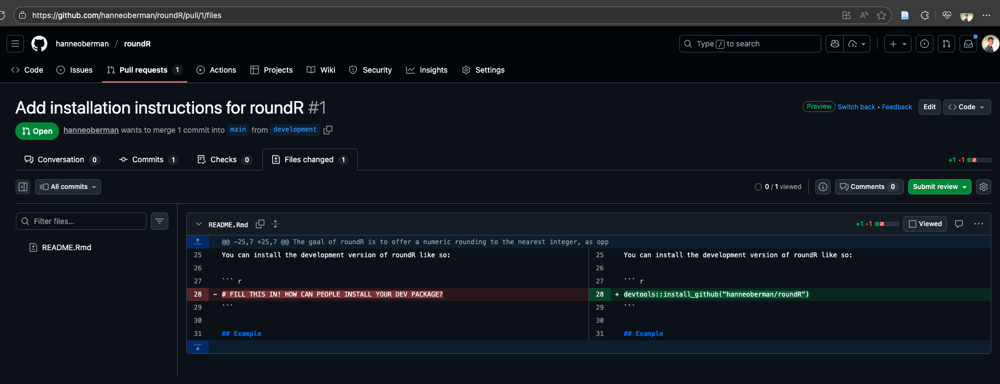
:::

If you are happy with the proposed changes, click 'Merge pull request' and then 'Confirm merge'.
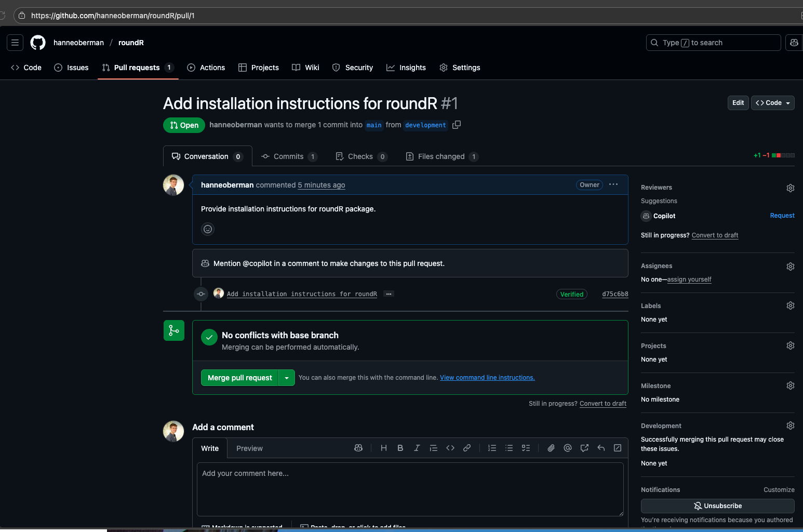
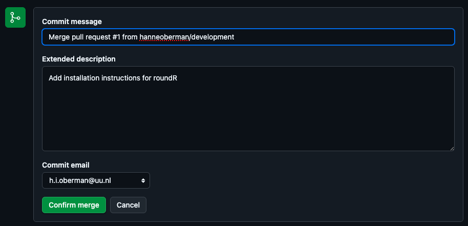

<center>
{width=90%}
</center>

When you go back to GitHub Desktop and `fetch` the changes on the 'remote' (that would be GitHub online), you will see that you have now access to the updated `README` file and the `development` branch.

<!-- TODO: open locally to re-render website/use GH Pages website? -->
Now, we can make sure that the online edits are presented in our updated package:

First render the `README.Rmd` file to plain markdown.
```{r, eval=FALSE}
devtools::build_readme()
```

```
ℹ Installing roundR in temporary library
ℹ Building /Users/4216318/Desktop/roundR/README.Rmd
```
This step updates the document `README.md`.

Then, update the package documentation.
```{r, eval=FALSE}
devtools::document()
```

```
ℹ Updating roundR documentation
ℹ Loading roundR
Writing roundR-package.Rd
```
This added the package website to the package help file.

And finally re-render the package website.
```{r, eval=FALSE}
pkgdown::build_site()
```
This updated website should be committed and pushed to be visible online. Then, at the online GitHub repo, we should turn on 'GitHub Pages' to make the package website available to others online. 

::: {.callout-tip collapse="true"}
# Automating website updates with GitHub Actions
Another option would have been to directly use the function `usethis::usethis::use_pkgdown_github_pages()` to launch the website from your local RStudio.

Set-up a GitHub pages branch to launch the package website from.
```{r, eval=FALSE}
usethis::use_github_pages()
```

```
✔ Setting active project to "your-directory/roundR".
✔ Initializing empty, orphan branch "gh-pages" in GitHub repo "hanneoberman/roundR".
✔ GitHub Pages is publishing from:
• URL: "https://hanneoberman.github.io/roundR/"
• Branch: "gh-pages"
• Path: "/"
```

Commit the changes. Push the changes. Check GitHub repo: banner with recent changes on dev branch, added branch number 3, 'deployments' added github-pages (https://github.com/hanneoberman/roundR/deployments/github-pages). Click branch `development`. See it's empty. Why?
:::

The website is not uploaded with the package, because it's ignored by `git`.

In the file `.gitignore`, the package documentation is blocked from uploading to GitHub. **Remove** the `docs` folder from the list of files/directories that are not tracked with `git`.

```
.Rproj.user
.Rhistory
.RData
.httr-oauth
.DS_Store
.quarto
```

Save the `.gitignore` file and push the changes to GitHub.

Now, the package website will be uploaded to the GitHub repository and launched online via GitHub Pages. To evaluate this process, see the 'GitHub Actions' tab on GitHub, or directly check whether the website is live via the package website URL.

<!-- TODO: Add automated checking with continuous integration -->
<!-- use_github_action() -->
<!-- Which action do you want to add? (0 to exit) -->
<!-- (See <https://github.com/r-lib/actions/tree/v2/examples> for other options)  -->

<!-- 1: check-standard: Run `R CMD check` on Linux, macOS, and Windows -->
<!-- 2: test-coverage: Compute test coverage and report to https://about.codecov.io -->

<!-- Selection:  -->
### Registering a `DOI`
Now that we have a proper and open source package online and the world as our user base, it would be wise to allow for proper referencing of our package.

GitHub and `Zenodo` have paired to facilitate this procedure. If you link your `Zenodo` account to GitHub, [as outlined here](https://docs.github.com/en/repositories/archiving-a-github-repository/referencing-and-citing-content), you only have to click, copy and paste to fully make your GitHub repo citeable. 

<center>
{width=90%}
</center>

### Add citation
`Zenodo` prepares the repository citation for us. We can simply grab the info, change our personal information and submit it to GitHub. 

<center>
{width=90%}
</center>

The final step before we would put our package *out there* is to notify how users can refer to our package. Run the following code:
```{r eval = FALSE}
usethis::use_citation()
```
which will create the necessary citation files for modification
```{r eval = FALSE}
✔ Creating 'inst/'
✔ Writing 'inst/CITATION'
• Modify 'inst/CITATION'
```

We can now simply grab the text and/or `bibtex` citation from GitHub and paste it into the `CITATION` file. The citation info cf. R packages could be:
```{r eval=FALSE}
citHeader("To cite roundR in publications use:")

citEntry(
  entry    = "Manual",
  title    = "hanneoberman/roundR: Version 0.1.0 - First release",
  author   = "Gerko Vink and Hanne Oberman",
  year     = "2025",
  doi      = "10.5281/zenodo.7668889",
  url      = "github.com/gerkovink/roundR",
  textVersion = paste(
"Vink, G and Oberman, H.I. (2025). gerkovink/roundR: Version 0.1.0 - First release (Version v0.2.0) [Computer software]. https://doi.org/10.5281/zenodo.7668889"
  )
)
```

Modify this to your name and paste it into the `CITATION` file.

<center>
{width=90%}
</center>

### Installing your own package from GitHub
Go to GitHub Desktop, and commit and push the changes to GitHub. Then run the following code block:
```{r}
#| eval: false

devtools::install_github("hanneoberman/roundR")
```
where you replace `"hanneoberman/roundR"` with your GitHub handle and repository name. 

<center>
{width=90%}
</center>

That's it! Please see the [Take aways](03_take-aways.qmd) tab for some final remarks and advanced topics.